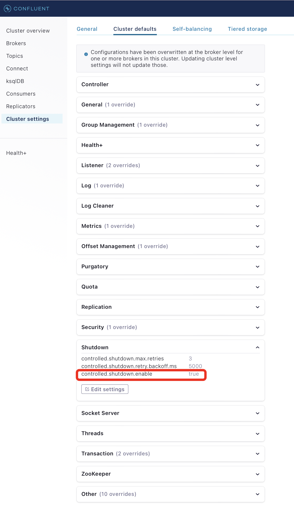
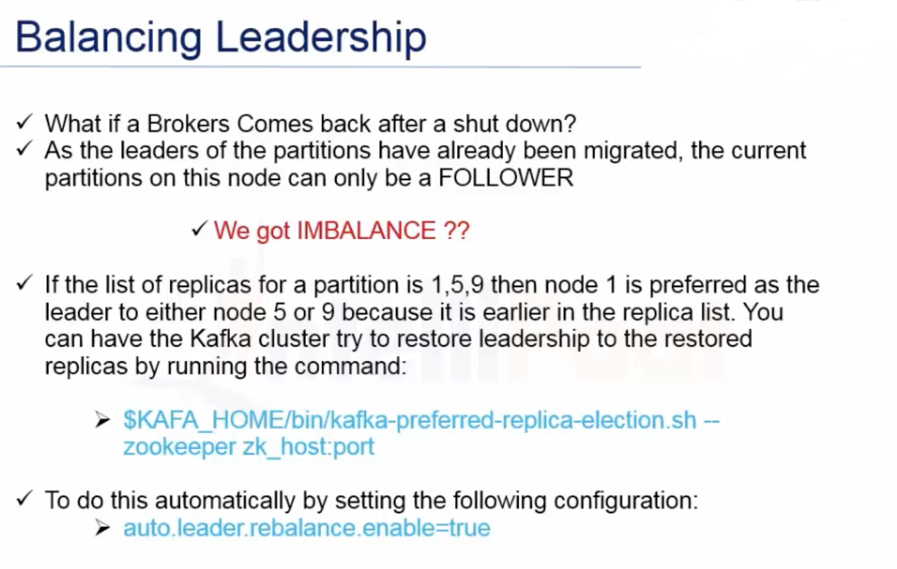
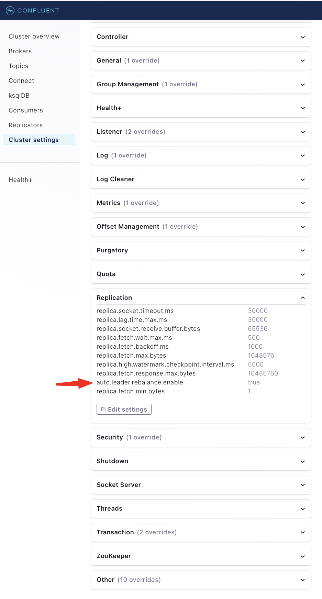
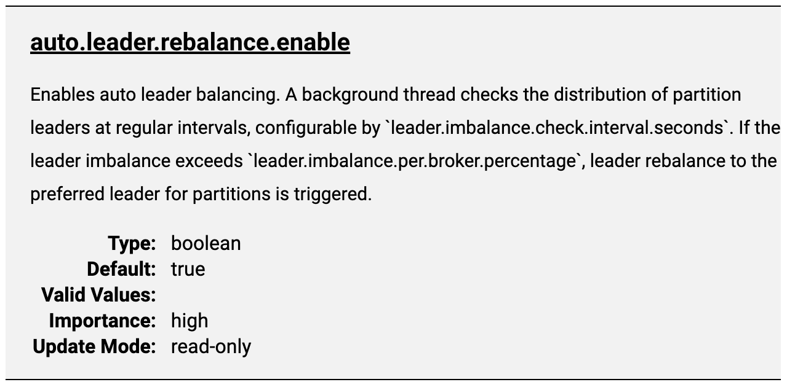
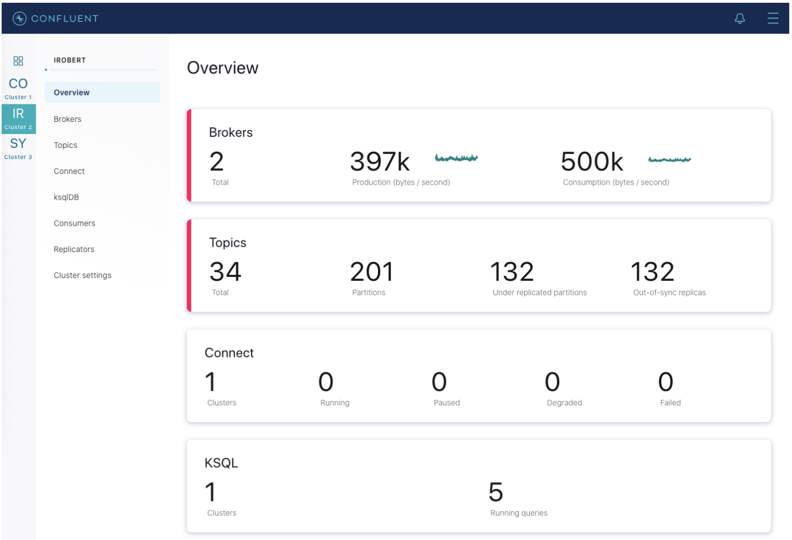
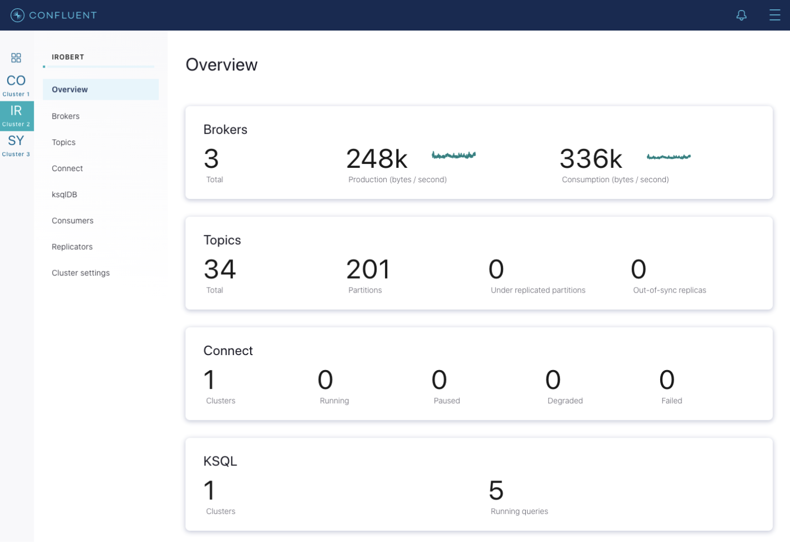

#####

  * Kafka Configuration with kafka-configs.sh :-
    > Apache Kafka includes a command-line tool named <b>kafka-configs.sh</b> used to obtain configuration values for various types of entities such as topics, clients, users, brokers, and loggers. 

    > Kafka Configuration - A general introduction :<br/><br/>
      We need to know there are two types of configuration properties in Apache Kafka: dynamic and static. <br/><br/>
        Properties specified at startup and remain fixed for the duration of the broker or client’s life are known as static configuration values. For brokers and clients, respectively, these properties are normally set in the configuration file or supplied as command-line arguments when the process is launched. broker.id, advertised.listeners, log.dirs, and other terms are examples of static configuration settings. <br/><br/>On the other side, dynamic configuration values are settings which can be changed while the Kafka broker or client is still running. That’s how they got the name “dynamic” <br/><br/>Both the <b>Kafka Admin API</b> and the <b>kafka-configs.sh</b> utility allow for the modification of these properties. max.connections.per.ip, log.retention.ms, log.flush.interval.ms, and other parameters are examples of dynamic configuration values. <br/><br/>The main benefit of dynamic configuration values is ability to quickly change Kafka configurations without needing to restart. This can be very helpful when you need to temporarily alter configuration values or modify settings in response to shifting workloads or performance requirements. <br/><br/>Static configuration values, on the other hand, are normally set on initialization and remain the same throughout the runtime. By modifying the configuration file and restarting the process, static configuration values can be changed, although this can be disruptive and requires downtime.

    > How to kafka-config.sh :<br/><br/>
        Managing the setup of Kafka brokers, topics, and clients is possible with the help of the shell script kafka-configs.sh, which is included with Apache Kafka in the bin/ directory. Kafka configuration settings can be viewed changed and accessed using it. We are going to use it in examples below.

  * Graceful shutdown :-
    > The Kafka cluster will automatically detect any broker shutdown or failure and elect new leaders for the partitions on that machine. This will occur whether a server fails or it is brought down intentionally for maintenance or configuration changes. For the later cases Kafka supports a more graceful mechanism for stoping a server then just killing it. When a server is stopped gracefully it has two optimizations it will take advantage of: <br/><br/>
    >1.  <b>It will sync all its logs to disk to avoid needing to do any log recovery when it restarts</b> (i.e. validating the checksum for all messages in the tail of the log). Log recovery takes time so this speeds up intentional restarts. <b>NOTE:</b> sync all its logs to disk is - automatic<br/><br/>
    >2.  <b>It will migrate any/all partitions the server is the leader for to other replicas prior to shutting down in milliseconds (i.e. from the down kafka node to the other node(s)).</b>This does not mean we are moving the partitions manually but we will simply transfer the leadership. For example, if we are having 3 replica, and say 1 broker goes down and it was having 1 leader replica so now the leadership will be transferred to the rest of the replica partitions.<u>This will make the leadership transfer faster and minimize the time each partition is unavailable to a few milliseconds.</u>
    Syncing the logs will happen automatically whenever the server is stopped <b>other than by a hard kill</b>, but the controlled leadership migration requires using a special setting:<br/> <font color="red">controlled.shutdown.enable=true</font><br/>
    ><i><font color="blue">** If this property is set the leadership election will be done automatically by Kafka.</font></i><br/><br/>

    > [[Config from control.center]]
    

    > <br/><b>Note</b> that controlled shutdown will only succeed if all the partitions hosted on the broker have replicas (i.e. the replication factor is greater than 1 and at least one of these replicas is alive). This is generally what you want since shutting down the last replica would make that topic partition unavailable.        

    > [[REF]] : https://docs.confluent.io/platform/current/kafka/post-deployment.html

  * Balancing Leadership :-  
    > As we know that as soon as Node/Broker goes down, all of it's partitions, leadership will be transferred to it's replica. Consider that node came back up, what will happen then as the leadership has already been transferred, the Broker that came up with will simply work as Follower which means that all reads & writes will not go to that node because the partitions that are present on that Broker are only Followers and not the Leader. So what we got - we got IMBALANCE. To maintain or to handle this kind of situation we need to run <kbd>kafka-preferred-replica-election.sh</kbd>   .<br/><br/>
    <!-- > **⚠ TIP: .**  -->
    <!-- > | ℹ️ TIP                           |  -->
    > **💡 TIP** <br/>
    Kafka consumers can subscribe to multiple topics and start receiving messages. <b>Rebalance</b> is a short window of unavailability to the entire consumer group when consumers cannot consume messages. To balance the leadership, it has two criteria for a broker to be preferred as a leader. <br/>1. It should be an in-sync replica, and <br/>2. it has to be the first element on the replicas list. You can run the code: <br/><br/>
    <kbd>bin/kafka-topics.sh --describe --zookeeper rhost:2181</kbd> <br/><br/>
    This displays the leadership details of the Kafka broker. These Kafka brokers have a property that can be set in the server.properties file, which enables us to auto-rebalance the leadership. Set <kbd>auto.leader.rebalance.enable=true</kbd> to brokers and restart Kafka. This way, we can do the balancing of leadership in Kafka.
    
    > Refer the snapshot to understand this scenario
      <br/><br/>
    > [[Config from control.center]]
     <br/><br/>
    ```Tip``` : 

  * Expanding the Cluster :-  
    > As we know that as soon as Node/Broker goes down, all of it's partitions, leadership will be transferred to it's replica. Consider that node came back up, what will happen then as the leadership has already been transferred, the Broker that came up with will simply work as Follower which means that all reads & writes will not go to that node because the partitions that are present on that Broker are only Followers and not the Leader. So what we got - we got IMBALANCE. To maintain or to handle this kind of situation we need to run <kbd>kafka-preferred-replica-election.sh</kbd>   .<br/><br/>

  * Rolling restart :-  
    > If you need to do software upgrades, broker configuration updates, or cluster maintenance, then you will need to restart all the brokers in your Kafka cluster. To do this, you can do a rolling restart by restarting one broker at a time. Restarting the brokers one at a time provides high availability by avoiding downtime for end users.<br/><br/>
    Some considerations to avoid downtime include:<br/>
    > * Use <font color="blue">Confluent Control Center</font> to monitor broker status during the rolling restart.
    > * Because one replica is unavailable while a broker is restarting, clients will not experience downtime if the number of remaining in sync replicas is greater than the configured <font color="red">min.insync.replicas</font>.
    > * Run brokers with <font color="red">controlled.shutdown.enable=true</font> to migrate topic partition leadership before the broker is stopped.
    > * The active controller should be the last broker you restart. This is to ensure that the active controller is not moved on each broker restart, which would slow down the restart.
    
    > <br/>Before starting a rolling restart: <br/><br/>
    >1. Verify your cluster is healthy and there are no under replicated partitions. In Control Center, navigate to Overview of the cluster, and observe the Under replicated partitions value. If there are under replicated partitions, investigate why before doing a rolling restart. <br/><br/>
    >2. Identify which Kafka broker in the cluster is the active controller. The active controller will report 1 for the following metric kafka.controller:type=KafkaController,name=ActiveControllerCount and the remaining brokers will report 0. <br/><br/>
    
    > <br/>Use the following workflow for rolling restart:
    >1. Connect to one broker, being sure to leave the active controller for last, and stop the broker process gracefully. Do not send a <font color="red">kill -9</font> command. Wait until the broker has completely shutdown.<br/><br/>
    ```##Tip```
  These instructions are based on the assumption that you are installing Confluent Platform by using ZIP or TAR archives. For more information, see Install Confluent Platform On-Premises.
  <br/><br/>
<kbd>bin/kafka-server-stop</kbd><br/><br/>

    >2. If you are performing a <font color="blue">software upgrade</font> or making any system configuration changes, follow those steps on this broker. (If you are just changing broker properties, you could optionally do this before you stop the broker)<br/><br/>

    >3. Start the broker back up, passing in the broker properties file.<br/>
        <kbd>bin/kafka-server-start etc/kafka/server.properties</kbd> <br/><br/>

    >4. Wait until that broker completely restarts and is caught up before proceeding to restart the next broker in your cluster. Waiting is important to ensure that leader failover happens as cleanly as possible. To know when the broker is caught up, in Control Center, navigate to <b>Overview</b> of the cluster, and observe the <b>Under replicated partitions</b> value. During broker restart, this number increases because data will not be replicated to topic partitions that reside on the restarting broker.
 <br/>
    After a broker restarts and is caught up, this number goes back to its original value before restart, which should be <font color="red">0</font> in a healthy cluster.

    <br/><br/>
    >5. Repeat the above steps on each broker until you have restarted all brokers but the active controller. Now you can restart the active controller.

  <br/><br/>
  * Scaling the cluster (adding a node to a Kafka cluster) :-  

    ```##Tip``` To learn more about adding nodes and rebalancing, see Self-Balancing Clusters, Auto Data Balancing, Configure a Multi-Node Environment with Docker, and Run a multi-broker cluster.

    > Adding servers to a Kafka cluster is easy, just assign them a unique broker ID and start up Kafka on your new servers. However these new servers will not automatically be assigned any data partitions, so unless partitions are moved to them they won’t be doing any work until new topics are created. So usually when you add machines to your cluster you will want to migrate some existing data to these machines. Other common reasons for migrating data are decommissioning of brokers and rebalancing data across the cluster (when it becomes unbalanced). <br/><br/>
    > Starting with Confluent Platform 6.0.0, you can use [Self-Balancing Clusters](https://docs.confluent.io/platform/current/kafka/sbc/index.html#sbc)to automatically manage the distribution of data across partitions. Self-Balancing Clusters will auto-initiate a rebalance if needed based on a number of metrics and factors, including when Kafka nodes (brokers) are added or removed. <br/><br/>
    > In Confluent Platform versions previous to 6.x, the process of migrating data must manually initiated but fully automated. Under the covers, when Kafka moves a partition, it will add a new replica on the destination machine as a follower of the partition it is migrating. The new replica is allowed to replicate and when it is fully caught up, it will be marked as in-sync. Then one of the existing replicas on the original server will be deleted, completing the move.
    > Confluent Platform includes the [confluent-rebalancer](https://docs.confluent.io/platform/current/kafka/rebalancer/index.html#rebalancer) tool and the open source Kafka <font color="red">kafka-reassign-partitions</font> tool. The Confluent Rebalancer has the following advantages:
    > * Minimises data movement
    > * Balances data at both cluster and topic level (instead of just topic level)
    > * Balances disk usage across brokers (in addition to balancing the number of leaders and replicas across racks and brokers)
    > * Supports decommissioning of broker(s)
    > * Supports moving partitions away from dead brokers <br/><br/>
    
    
    > The [confluent-rebalancer](https://docs.confluent.io/platform/current/kafka/rebalancer/index.html#rebalancer) is described in a separate [page](https://docs.confluent.io/platform/current/kafka/rebalancer/index.html#rebalancer).<br/><br/>
    > The open source partition reassignment tool can run in 3 mutually exclusive modes -<br/>
    > * <font color="red">--generate</font>: In this mode, given a list of topics and a list of brokers, the tool generates a candidate reassignment to move all partitions of the specified topics to the new brokers. This option merely provides a convenient way to generate a partition reassignment plan given a list of topics and target brokers.<br/>
    > * <font color="red">--execute</font>: In this mode, the tool kicks off the reassignment of partitions based on the user provided reassignment plan. (using the <font color="red">--reassignment-json-file</font> option). This can either be a custom reassignment plan hand crafted by the admin or provided by using the –generate option<br/>
    > * <font color="red">--verify</font>: In this mode, the tool verifies the status of the reassignment for all partitions listed during the last <font color="red">--execute</font>. The status can be either of successfully completed, failed or in progress<br/><br/>


    > The partition reassignment tool does not have the ability to automatically generate a reassignment plan for decommissioning brokers yet. As such, the admin has to come up with a reassignment plan to move the replica for all partitions hosted on the broker to be decommissioned, to the rest of the brokers. This can be relatively tedious as the reassignment needs to ensure that all the replicas are not moved from the decommissioned broker to only one other broker. As stated previously, the <font color="blue">confluent-rebalancer</font> has built-in support for this. <br/>


  * Rolling restart :-  
    > If you need to do software upgrades, broker configuration updates, or cluster maintenance, then you will need to restart all the brokers in your Kafka cluster. To do this, you can do a rolling restart by restarting one broker at a time. Restarting the brokers one at a time provides high availability by avoiding downtime for end users.<br/><br/>