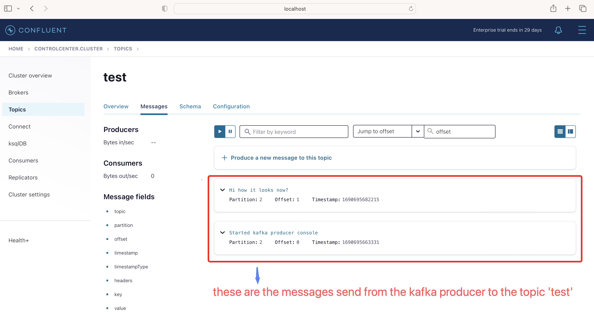
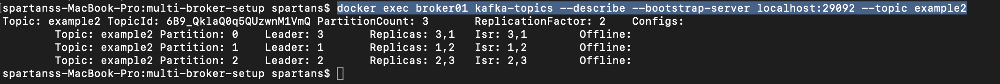
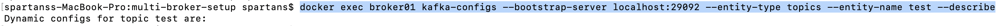
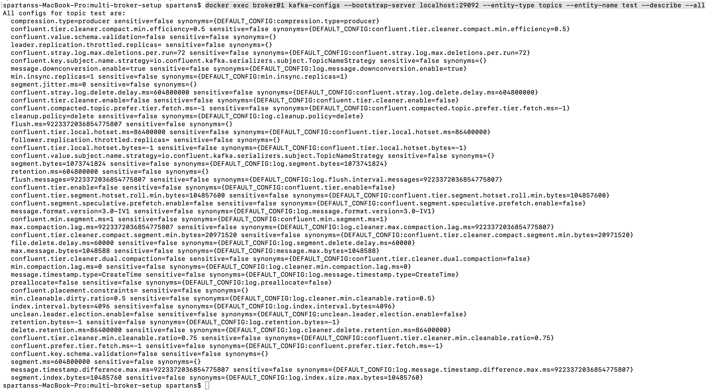
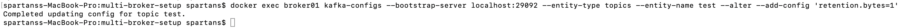
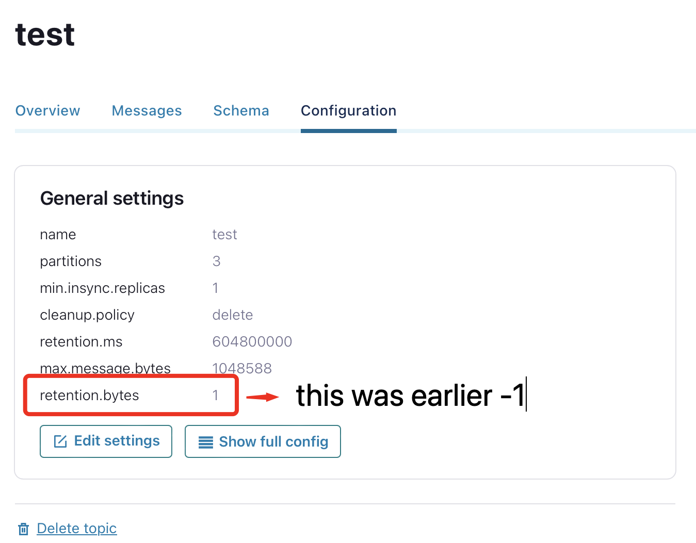

#####

  * URL to launch control-center locally post kafka container spawned up using docker (REFER kafka_zookeeper/setup-kafka_zookeeper-as-docker)
    compose files

    http://localhost:9021/

  * COMMANDS :-
  * *  commands to spawn the docker containers
    *  #> docker-compose up -d
   
    *  commands to get/list help related to kafka topic
    * *  #> docker exec broker01 kafka-topics --help (** in case of multi broker setup)
    * *  #> docker exec broker kafka-topics --help (** in case of single broker setup)

    *  commands to get/list help related to kafka topic
    * *  #> docker exec broker01 kafka-topics --help (** in case of multi broker setup)
    * *  #> docker exec broker kafka-topics --help (** in case of single broker setup)

    *  commands to list kafka topic
    * *  #> docker exec broker01 kafka-topics --list --bootstrap-server localhost:29092 (** in case of multi broker setup)
    * *  #> docker exec broker kafka-topics --list --bootstrap-server localhost:29092 (** in case of single broker setup)

    *  commands to create kafka topic
    * *  #> docker exec broker01 kafka-topics --create --bootstrap-server localhost:29092 --partitions 3 --replication-factor 3 --topic test (** in case of multi broker setup when creating a topic having 3 partitions and replication factor set to 3 when having 3 broker clusters)
    * *  #> docker exec broker kafka-topics --create --bootstrap-server localhost:29092 --partitions 3 --replication-factor 1 --topic test (** in case of single broker setup)

    *  commands to alter kafka topic properties like partition or replication-factor, etc.
    * *  #> docker exec broker01 kafka-topics --alter --bootstrap-server localhost:29092 --partitions 3 --topic test (** in case of multi broker setup)
    * *  #> docker exec broker kafka-topics --alter --bootstrap-server localhost:29092 --partitions 3 --topic test (** in case of multi broker setup)

    *  commands to delete kafka topic
    * *  #> docker exec broker01 kafka-topics --bootstrap-server localhost:29092 --delete --topic testing (** in case of multi broker setup)
    * *  #> docker exec broker kafka-topics --bootstrap-server localhost:29092 --delete --topic testing (** in case of single broker setup)

    *  commands to start kafka-producer to send messages to topic 'test'.
    * *  #> docker exec -it broker01 kafka-console-consumer --bootstrap-server localhost:29092 --topic test (** in case of multi broker setup)
    * *  #> docker exec -it broker kafka-console-consumer --bootstrap-server localhost:29092 --topic test (** in case of single broker setup)

    *  commands to start kafka-producer to send messages to topic 'test'.
    * *  #> docker exec -it broker01 kafka-console-producer --bootstrap-server localhost:29092 --topic test (** in case of multi broker setup)
    * *  #> docker exec -it broker kafka-console-producer --bootstrap-server localhost:29092 --topic test (** in case of single broker setup) 
    
    * * [[OUTPUT]] from 'confluent control center'
        

    *  commands to start kafka-consumer to receive messages from topic 'test'.
    * *  #> docker exec -it broker01 kafka-console-consumer --bootstrap-server localhost:29092 --topic test (** in case of multi broker setup)
    * *  #> docker exec -it broker kafka-console-consumer --bootstrap-server localhost:29092 --topic test (** in case of single broker setup) 

    > **_NOTE:_** to start reading the topic from beginning, give below command
    >  * *  #> docker exec -it broker01 kafka-console-consumer --bootstrap-server localhost:29092 --topic test --from-beginning (** in case of multi broker setup)
    >  * *  #> docker exec -it broker kafka-console-consumer --bootstrap-server localhost:29092 --topic test --from-beginning (** in case of single broker setup)

    *  commands to check which Broker is listening on the created topic say 'example2'.
    * *  #> docker exec broker01 kafka-topics --describe --bootstrap-server localhost:29092 --topic example2 (** in case of multi broker setup)
    * *  #> docker exec broker kafka-topics --describe --bootstrap-server localhost:29092 --topic example2 (** in case of single broker setup)

    > **_NOTE:_** above command is used to check which broker is listening on the current created topic, so when we type 
             describe, we will get an id of which partition is listening to which topic 

      * * [[OUTPUT]] 
          

    *  commands to displays the leadership details of the kafka-broker.
    * *  #> docker exec broker01 kafka-topics --describe --bootstrap-server localhost:29092 (** in case of multi broker setup)
    * *  #> docker exec broker kafka-topics --describe --bootstrap-server localhost:29092 (** in case of single broker setup)

    *  commands to view Kafka topic configuration with kafka-config.sh on the created topic say 'example2'.
    * *  #> docker exec broker01 kafka-configs --bootstrap-server localhost:29092 --entity-type topics --entity-name test --describe (** in case of multi broker setup)
    * *  #> docker exec broker kafka-configs --bootstrap-server localhost:29092 --entity-type topics --entity-name test --describe (** in case of single broker setup)

      * * [[OUTPUT]] 
              

      * * > **_NOTE:_** command to view kafka topic configuration >= Kafka 2.5 using --all option is available from newer versions of CLI.          
                  #> docker exec broker01 kafka-configs --bootstrap-server localhost:29092 --entity-type topics --entity-name test --describe --all (** in case of multi broker setup)  
                  #> docker exec broker kafka-configs --bootstrap-server localhost:29092 --entity-type topics --entity-name test --describe --all (** in case of single broker setup)    
                 * * [[OUTPUT]] 
                     

    *  commands to change configuration on the created topic say 'example2'.
    * *  #> docker exec broker01 kafka-topics --bootstrap-server localhost:29092 --alter --topic example2 --config max.message.bytes=128000 (** in case of multi broker setup)
    * *  #> docker exec broker kafka-topics --bootstrap-server localhost:29092 --alter --topic example2 --config max.message.bytes=128000 (** in case of single broker setup)

    * * > **_NOTE:_** command to change kafka topic configuration >= Kafka 2.5 using --add-config option is available from newer versions of CLI.          
                  #> docker exec broker01 kafka-configs --bootstrap-server localhost:29092 --entity-type topics --entity-name test --alter --add-config 'retention.bytes=1' (** in case of multi broker setup)  
                  #> docker exec broker kafka-configs --bootstrap-server localhost:29092 --entity-type topics --entity-name test --alter --add-config 'retention.bytes=1' (** in case of single broker setup)    
                 * * [[OUTPUT]] 
                     
                 * * [[OUTPUT from control center]] 
                         

    *  commands to alter created topic say 'example2'.
    * *  #> docker exec broker01 kafka-topics --bootstrap-server localhost:29092 --alter --topic example2 --delete-config max.message.bytes (** in case of multi broker setup)
    * *  #> docker exec broker kafka-topics --bootstrap-server localhost:29092 --alter --topic example2 --delete-config max.message.bytes (** in case of single broker setup)

    _; NOTE: above command is used to check which broker is listening on the current created topic, so when we type 
             describe, we will get an id of which partition is listening to which topic 

      * * [[OUTPUT]] 
                    

    
    

    

    
