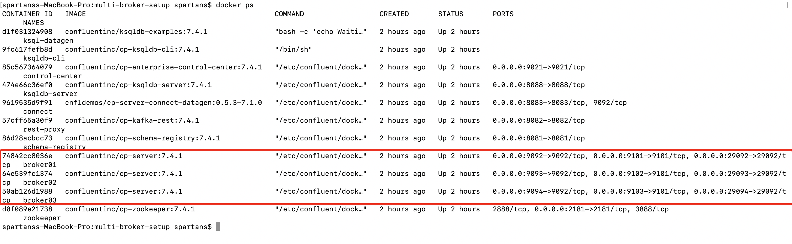
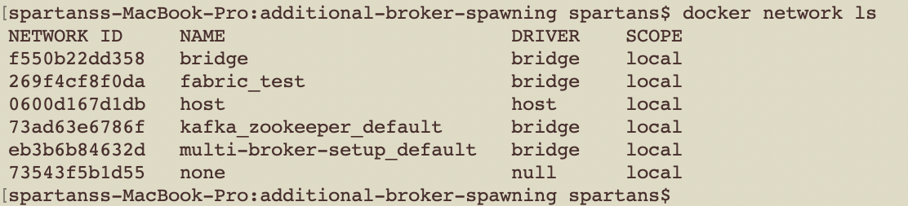
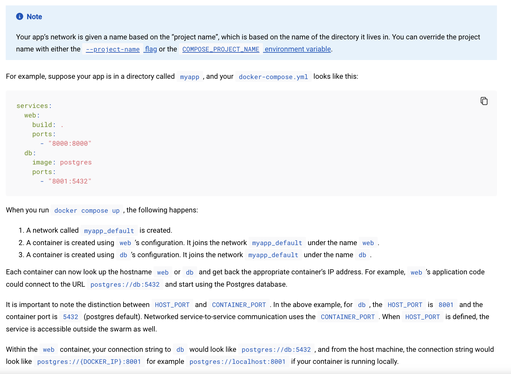
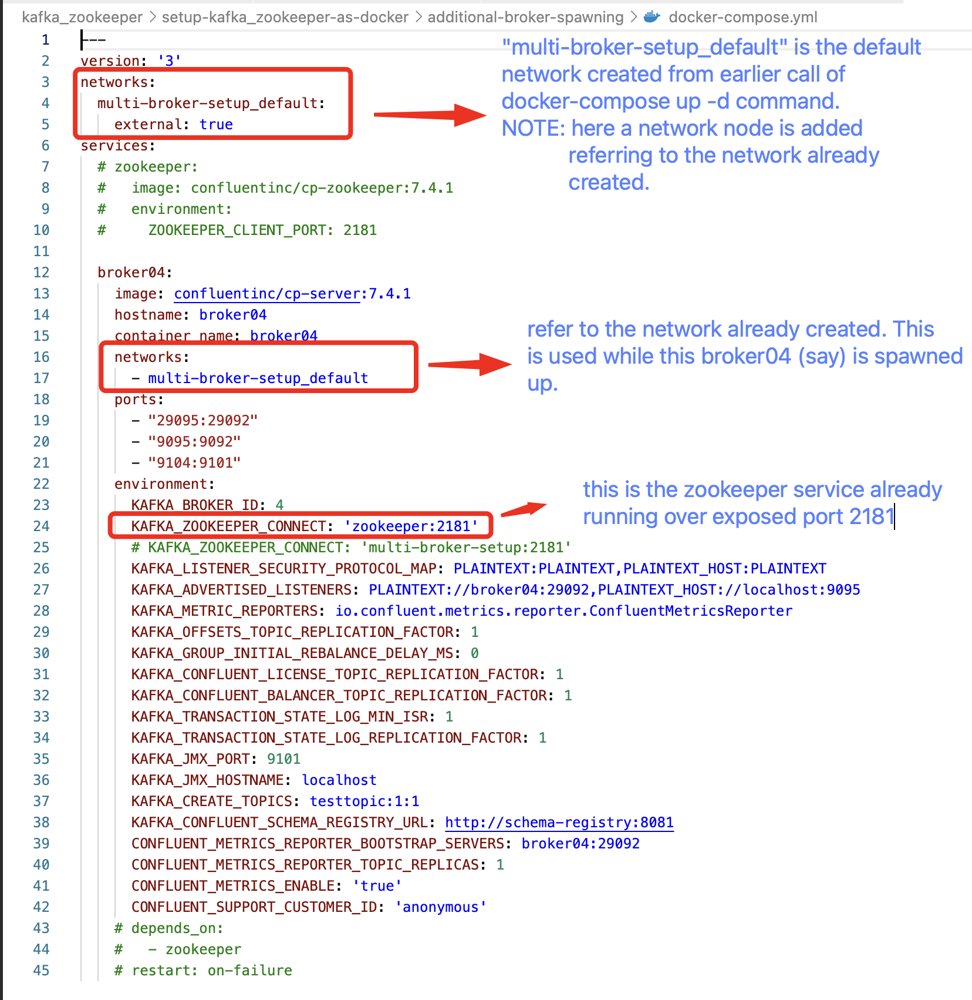
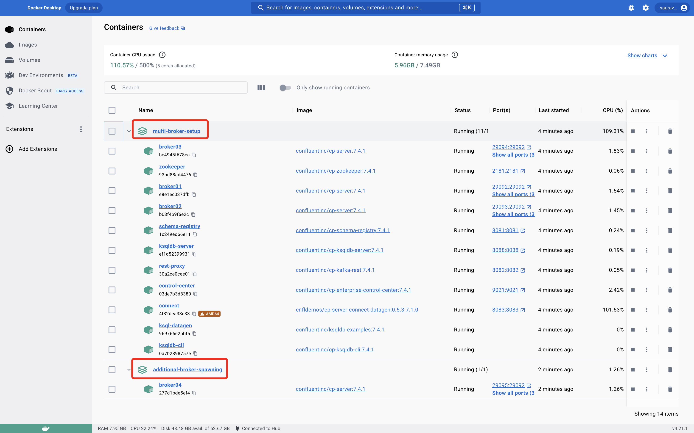
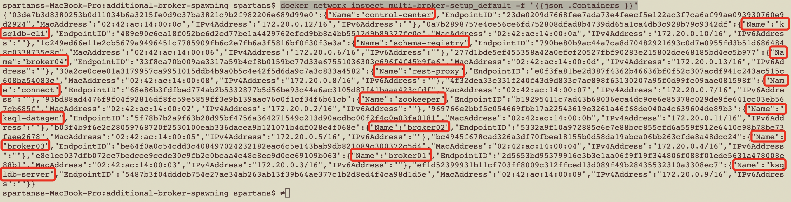

#####covers setup of kafka & zookeeper over docker

  * single-broker-setup : helps to setup single broker kafka cluster managed by zookeeper
  * multi-broker-setup  : helps to setup multi broker (3 brokers) kafka cluster managed by zookeeper

  * COMMANDS :-
  * *  commands to spawn the docker containers
    *  #> <kbd>docker-compose up -d </kbd>  

  * * SNAPSHOT (when multi-broker spawned-up using above command) :-  
    *  

  * *  commands to list all networks the Engine <kbd>docker daemon</kbd> knows about. This includes the networks that span across multiple hosts in a cluster.
    *  #> <kbd>docker network ls </kbd>  
      

    * > NOTE: Use the <kbd>--no-trunc</kbd> option to display the full network id:

  * *  commands to spawn up additional kafka broker but the crux is here we have to use already running zookeeper service which was spawned above as part of docker-compose file (i.e. from directory "multi-broker-setup" or "single-broker-setup").
    * > NOTEs :- for this following sequence of steps to be carried and following points to be kept in mind:  
      >  1. [Networking in Compose](https://docs.docker.com/compose/networking/):-  
            a.    By default Compose sets up a single network for your app. Each container for a service joins the default network and is both reachable by other containers on that network, and discoverable by them at a hostname identical to the container name.
             
            b. Similarly from above command, when we have spawned docker containers using multi-broker-setup/docker-compose, we can see that a new network or rather a default network is created by name of the directory in which docker-compose.yaml file is, here the network name created is "multi-broker-setup_default" ( ℹ️ TIP :- refer <kbd>docker network ls</kbd> to check this out)   
      > 2. Then update the network details as per below snapshot from the docker-compose.yaml file from directory '/additional-broker-spawning/'
              
             
      > 3. Finally, spawn another kafka broker using command <kbd>docker-compose up -d</kbd> . This is going to spawn additional kafka broker container and will use zookeeper service already running through the nerwork_name created previously 'multi-broker-setup_default'.   
            ℹ️ TIP :- refer below image from docker-desktop to check the docker containers running.  
               
      
        
  * *  commands to see what network(s) your container is ON, assuming your container is called c1:
    *  #> <kbd>docker inspect c1 -f "{{json .NetworkSettings.Networks }}" </kbd>  

  * *  commands To disconnect your container from the first network (assuming your first network is called test-net):
    *  #> <kbd>docker network disconnect test-net c1 </kbd>    

  * *  commands To reconnect the disconneted container (say) 'c1' to another network (assuming it's called test-net-2):
    *  #> <kbd>docker network connect test-net-2 c1 </kbd>    

  * *  commands To check if two containers (or more) are on a network together:
    *  #> <kbd>docker network inspect test-net -f "{{json .Containers }}" </kbd>    
            ℹ️ TIP :- refer below image to check and print what all containers connected to network 'multi-broker-setup_default' (which is spawned up earlier).  
               
 

  
   
  * REFERENCE :-
  * * 1.  https://hub.docker.com/r/confluentinc/cp-kafka
          Click on "Docker Quick Start for Apache Kafka using Confluent Platform" to check and understand how to start using the Docker
         
    * 2.  https://developer.confluent.io/what-is-apache-kafka/?_ga=2.245450948.1981174071.1690557606-1909534581.1690213316&_gac=1.47519445.1690213651.Cj0KCQjwwvilBhCFARIsADvYi7IXNPSgQsD2JVuy1Sf7Mk59YxCCezKSbUUySmvcoBivIjYktWrBrt4aApUbEALw_wcB&_gl=1*1mafsbz*_ga*MTkwOTUzNDU4MS4xNjkwMjEzMzE2*_ga_D2D3EGKSGD*MTY5MDU5OTM1Ny40LjEuMTY5MDU5OTc0MC41NS4wLjA.
          What Is Apache Kafka?
          
    * 3.  https://docs.confluent.io/platform/current/control-center/index.html#control-center
          Confluent Control Center
   
    * 4.  https://docs.confluent.io/platform/current/_glossary.html#term-event-streaming
          Apache Kafka Glossary

    * 5.  https://www.confluent.io/blog/kafka-listeners-explained/?_ga=2.165246143.1293268742.1690429846-1909534581.1690213316&_gac=1.15126980.1690213651.Cj0KCQjwwvilBhCFARIsADvYi7IXNPSgQsD2JVuy1Sf7Mk59YxCCezKSbUUySmvcoBivIjYktWrBrt4aApUbEALw_wcB&_gl=1*1biqphy*_ga*MTkwOTUzNDU4MS4xNjkwMjEzMzE2*_ga_D2D3EGKSGD*MTY5MDQyOTg0NS4yLjEuMTY5MDQyOTg1MC41NS4wLjA.
          Kafka Listeners – Explained

    * 6.  https://stackoverflow.com/questions/69547266/multi-broker-confluent-kafka-docker-compose-yml-file
          Multi-broker Confluent Kafka docker-compose.yml file

    * 7.  https://stackoverflow.com/questions/69843745/create-kafka-topic-in-docker-works-from-command-line-but-not-from-shell-script-f
          Create Kafka topic in Docker works from command line but not from Shell script file

    * 8.  https://stackoverflow.com/questions/64865361/docker-compose-create-kafka-topics
          Docker compose create kafka topics

    * 9.  https://www.baeldung.com/kafka-docker-connection
          Connect to Apache Kafka Running in Docker

    * 10. https://gist.github.com/DevoKun/01b6c9963d5508579f4cbd75d52640a9
          DevoKun/kafka.md

    * 11. https://www.markhneedham.com/blog/2019/05/23/deleting-kafka-topics-on-docker/
          Deleting Kafka Topics on Docker

    * 12. https://stackoverflow.com/questions/43904562/docker-how-to-find-the-network-my-container-is-in
          Docker : How to find the network my container is in?

    * 13. https://docs.docker.com/engine/reference/commandline/network_ls/
          docker network ls
               
             
